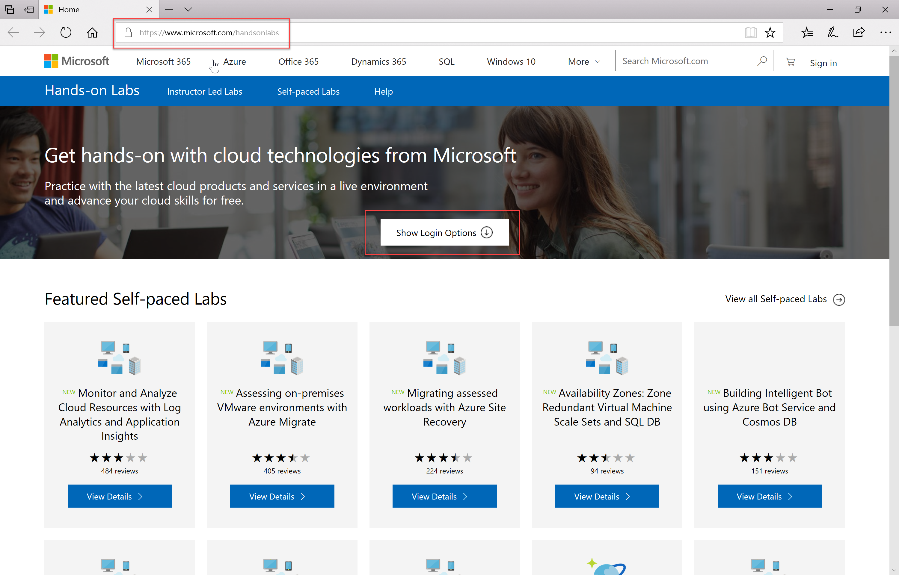
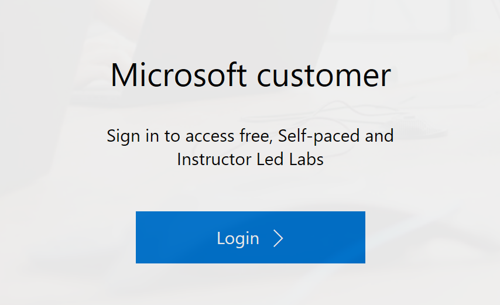
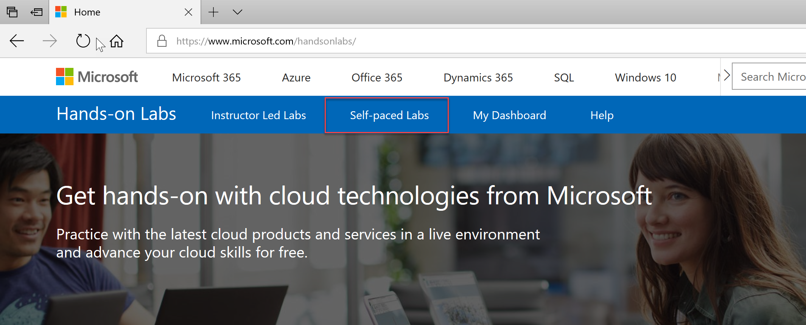
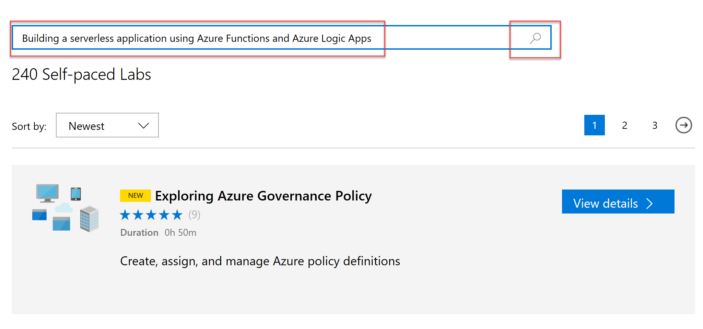
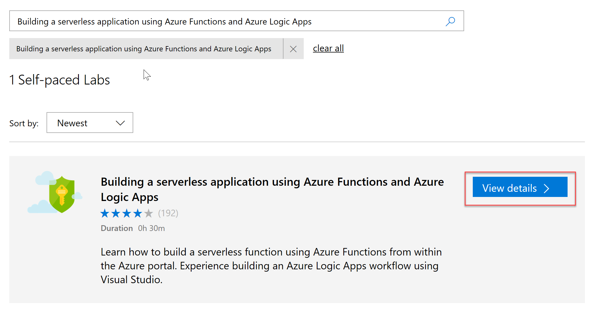
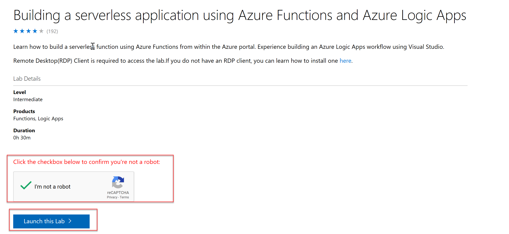
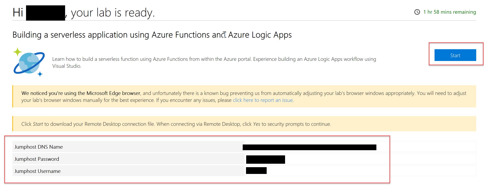

# Hands on Labs

To use hands on labs follow the instructions below

In your browser go to https://www.microsoft.com/handsonlabs

Click on **Show Login Options**
<figure>
        
</figure>

Click **Microsoft Customer** > **Login**

<figure>
        
</figure>

Enter an Outlook.com or Hotmail.com email address and password and sign in

Select **Self Paced Labs**

<figure>
        
</figure>

Enter the name of the lab you would like to complete and click on the search icon.

<figure>
        
</figure>

Click **View details**
<figure>
        
</figure>

Tick **I'm not a robot** and click **Launch this Lab**

<figure>
        
</figure>

After a few minutes you should see a similar screen below depending on the lab with you Azure account details and Jump box if applicable.

<figure>
        
</figure>
 

 [Back to labs table](./01Labs.MD)