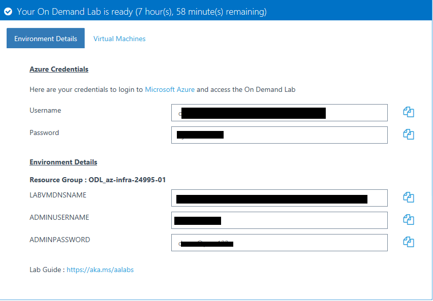
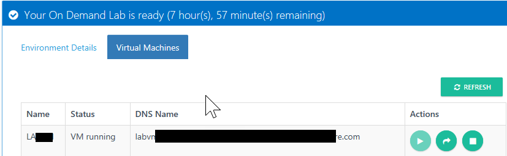

# Implementing Azure Infrastructure Workshop Labs

• Click on the link provided by your trainer and register for the lab session.
	
    ○ Note it may take a few minutes for the lab to be provisioned

• Once registered you will see a page similar to the screen shot below which will provide you with two things
	
    ○ Jump box DNS name, username and password
    ○ Azure Subscription Username and password
	○ Copy these out to Notepad for later use in case your browser closes

<figure>
        
        <figcaption>Lab Environment Details</figcaption>
</figure>
<figure>
        
        <figcaption>Virtual Machine Details</figcaption>
</figure>
	
	
• The Lab documentation links are on Github. Click on the following link to access them.

[Back to labs table](./01Labs.MD)

